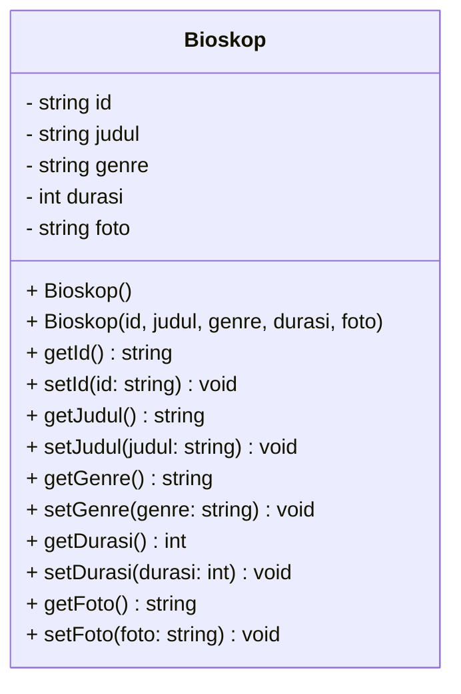
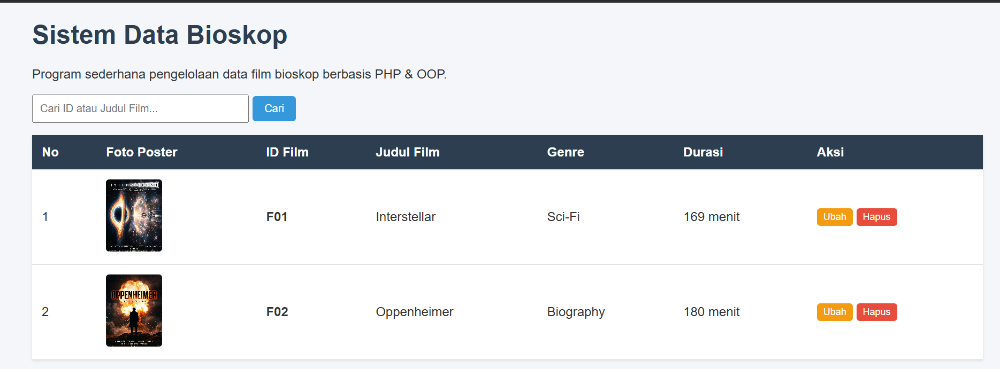

# TP1 DPBO 2026 - Pengelolaan Data Bioskop

## Janji
Saya Najib Nurohman NIM 2509653 mengerjakan evaluasi Tugas Praktikum 1 dalam mata kuliah Desain dan Pemrograman Berorientasi Objek untuk keberkahan-Nya maka saya tidak melakukan kecurangan seperti yang telah dispesifikasikan. Aamiin.

---

## Deskripsi
Program sederhana untuk mengelola data film di bioskop menggunakan konsep dasar OOP (*Encapsulation* dan *Class/Object*). Program ini diimplementasikan ke dalam 4 bahasa pemrograman:
- **C++** (CLI)
- **Java** (CLI)
- **Python** (CLI)
- **PHP** (Web sederhana)

Semua implementasi mendukung operasi dasar: **Create, Read, Update, Delete (CRUD)** dan **Search** data film.

---

## Desain Kelas (Class Diagram)



### Komponen Kelas `Bioskop`
- **Atribut**: `id` (ID film), `judul` (Judul film), `genre` (Genre film), `durasi` (Durasi menit), `foto` (File gambar poster).
- **Method**: Constructor (default & parameter) serta Getter dan Setter untuk masing-masing atribut.

---

## Fitur Utama
1. **Menampilkan Data Film**: Melihat seluruh daftar film yang tersimpan.
2. **Menambah Data Film**: Menambahkan film baru ke dalam daftar.
3. **Mengubah Data Film**: Mengedit informasi film berdasarkan ID.
4. **Menghapus Data Film**: Menghapus data film dari daftar berdasarkan ID.
5. **Mencari Data Film**: Mencari data film berdasarkan ID.

---

## Penanganan Error & Validasi Input (Error Handling)

Program telah dilengkapi dengan sistem penanganan error (*error handling*) dan validasi input yang komprehensif pada seluruh bahasa pemrograman (C++, Java, Python, dan PHP) guna mencegah program mengalami *crash*, *infinite loop*, maupun integritas data yang rusak.

### Tabel Ringkasan Kasus Error & Penanganannya

| No | Kasus / Skenario Error | Kondisi Penyebab | Solusi & Penanganan Program |
|---|---|---|---|
| 1 | **Pilihan Menu Tidak Valid** | Pengguna memasukkan opsi di luar rentang `1-6` atau memasukkan tipe data karakter/string (misal: `abc`, simbol). | Menampilkan pesan `"Menu tidak valid! Masukkan angka antara 1 sampai 6."`. Pada CLI, stream/buffer dibersihkan sehingga program tidak crash atau looping terus-menerus. |
| 2 | **Duplikasi ID Film (Duplicate Primary Key)** | Pengguna memasukkan ID film yang sudah terdaftar saat menambah data film baru (*Create*). | Sistem memverifikasi keunikan ID sebelum data ditambahkan. Jika ID sudah ada, proses penambahan ditolak dan muncul pesan `"Gagal: ID Film '[ID]' sudah terdaftar! Gunakan ID lain."` (CLI) atau alert kesalahan (PHP). |
| 3 | **Format & Nilai Durasi Tidak Valid** | Pengguna memasukkan nilai non-angka (huruf/simbol) atau angka $\le 0$ pada input durasi saat menambah atau mengubah data film. | Dilakukan validasi parsing numerik (*try-catch* / *stream validation*) dan pengecekan nilai positif (> 0). Jika tidak valid, muncul notifikasi `"Input durasi tidak valid! Durasi harus berupa angka positif."` dan perubahan dibatalkan. |
| 4 | **ID Film Tidak Ditemukan saat Ubah Data** | Pengguna memasukkan ID film yang tidak terdapat di dalam daftar saat memilih opsi Ubah (*Update*). | Sistem memeriksa kecocokan ID. Jika tidak ditemukan, sistem menampilkan pesan `"Data film dengan ID tersebut tidak ditemukan!"` dan membatalkan pengubahan. |
| 5 | **ID Film Tidak Ditemukan saat Hapus Data** | Pengguna memasukkan ID film yang tidak terdapat di dalam daftar saat memilih opsi Hapus (*Delete*). | Sistem menampilkan pesan `"Data film tidak ditemukan!"` dan daftar film tetap utuh. |
| 6 | **Operasi pada Daftar Film Kosong** | Pengguna memilih opsi Tampilkan, Ubah, Hapus, atau Cari ketika daftar film belum memiliki data sama sekali. | Sistem memvalidasi ukuran list/array: <br>- **Tampilkan**: Menampilkan `"Belum ada data film."`<br>- **Ubah/Hapus/Cari**: Menampilkan notifikasi bahwa daftar film masih kosong sehingga proses tidak dilanjutkan sia-sia. |
| 7 | **Pencarian Data Film Tidak Ditemukan** | Pengguna mencari film berdasarkan ID yang tidak ada di daftar. | Menampilkan pesan `"Film dengan ID [ID] tidak ditemukan."` (CLI) atau menampilkan baris `"Tidak ada data film."` pada tabel web PHP. |
| 8 | **Immutabilitas ID pada Form Ubah (PHP Web)** | Pengguna mencoba mengganti ID film yang merupakan *primary key*. | Field ID dibuat berstatus `disabled / readonly` pada form pengubahan di PHP untuk menjaga konsistensi identitas data. |
| 9 | **Penanganan Upload File Gambar & Fallback (PHP Web)** | Pengguna tidak mengunggah file poster, gagal upload, atau file fisik tidak ada di server. | - Jika poster tidak diunggah saat tambah data: Disetel file poster default (`default.jpg`).<br>- Jika poster tidak diganti saat edit: Foto lama dipertahankan.<br>- Jika file fisik hilang di folder `uploads/`: Terdapat *fallback handler* `file_exists()` agar tidak memicu *broken image*. |
| 10 | **Pencegahan Penghapusan Data Tidak Sengaja (PHP Web)** | Pengguna tidak sengaja mengklik tombol Hapus pada antarmuka web. | Dilengkapi dialog konfirmasi JavaScript `confirm('Yakin ingin menghapus film ini?')` sebelum aksi penghapusan dieksekusi. |

---

## Cara Menjalankan Program

### 1. C++
```bash
cd CPP
g++ main.cpp -o main
./main
```

### 2. Java
```bash
cd Java
javac Main.java Bioskop.java
java Main
```

### 3. Python
```bash
cd Python
python main.py
```

### 4. PHP
```bash
cd PHP
php -S localhost:8000
```
Akses melalui browser di: `http://localhost:8000/index.php`.

---

### Dokumentasi C++ & Java & Python
Interface Utama

---
Opsi 1

---
Opsi 2

---
Opsi 3

---
Data sebelum di hapus

---
Data sesudah di hapus (opsi 4)
.png)
---
Opsi 5

---
Opsi 6
.png)

### PHP
interface

---
tambah data film

---
ubah data film

---
cari data film


