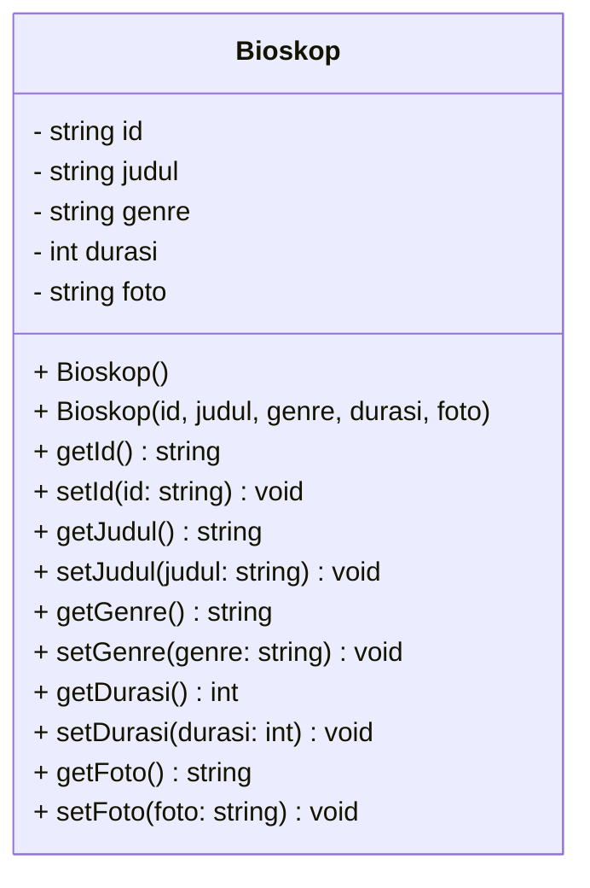

# TP1 DPBO 2026 - Pengelolaan Data Bioskop

## Janji
Saya Najib Nurohman NIM 2509653 mengerjakan evaluasi Tugas Praktikum 1 dalam mata kuliah Desain dan Pemrograman Berorientasi Objek untuk keberkahan-Nya maka saya tidak melakukan kecurangan seperti yang telah dispesifikasikan. Aamiin.

---

## Deskripsi
Program sederhana untuk mengelola data film di bioskop menggunakan konsep dasar OOP (*Encapsulation* dan *Class/Object*). Program ini diimplementasikan ke dalam 4 bahasa pemrograman:
- **C++** (CLI)
- **Java** (CLI)
- **Python** (CLI)
- **PHP** (Web sederhana)

Semua implementasi mendukung operasi dasar: **Create, Read, Update, Delete (CRUD)** dan **Search** data film.

---

## Desain Kelas (Class Diagram)



### Komponen Kelas `Bioskop`
- **Atribut**: `id` (ID film), `judul` (Judul film), `genre` (Genre film), `durasi` (Durasi menit), `foto` (File gambar poster).
- **Method**: Constructor (default & parameter) serta Getter dan Setter untuk masing-masing atribut.

---

## Fitur Utamas
1. **Menampilkan Data Film**: Melihat seluruh daftar film yang tersimpan.
2. **Menambah Data Film**: Menambahkan film baru ke dalam daftar.
3. **Mengubah Data Film**: Mengedit informasi film berdasarkan ID.
4. **Menghapus Data Film**: Menghapus data film dari daftar berdasarkan ID.
5. **Mencari Data Film**: Mencari data film berdasarkan ID.

---

## Cara Menjalankan Program

### 1. C++
```bash
cd CPP
g++ main.cpp -o main
./main
```

### 2. Java
```bash
cd Java
javac Main.java Bioskop.java
java Main
```

### 3. Python
```bash
cd Python
python main.py
```

### 4. PHP
```bash
cd PHP
php -S localhost:8000
```
akses ke sini bray `http://localhost:8000/index.php`.

---

### Dokumentasi C++ & Java & Phyton
Interface Utama

---
Opsi 1

---
Opsi 2

---
Opsi 3

---
Data sebelum di hapus

---
Data sesudah di hapus (opsi 4)
.png)
---
Opsi 5

---
Opsi 6
.png)

### PHP
interface

---
tambah data film

---
ubah data film

---
cari data film


